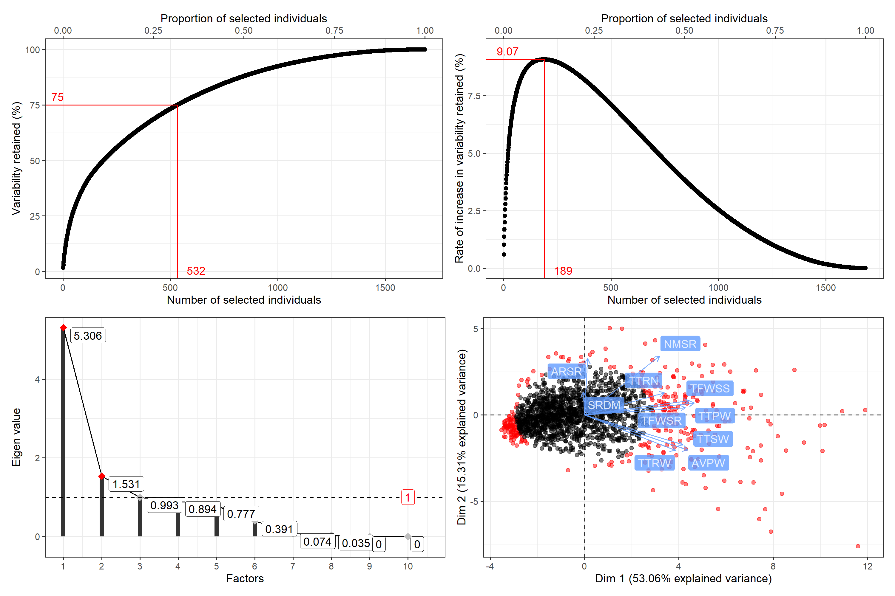

<!-- 

-->

## `rpcss`: Constitution of Core Collections by Principal Component Scoring Strategy 

###### Version : [0.1.0](https://aravind-j.github.io/rpcss/); License: [GPL-2\|GPL-3](https://www.r-project.org/Licenses/)

##### Aravind, J.

Division of Germplasm Conservation, ICAR-National Bureau of Plant
Genetic Resources, New Delhi.

------------------------------------------------------------------------

[](https://cran.r-project.org/)
[](https://www.gnu.org/licenses/gpl-3.0)
[](https://cran.r-project.org/package=rpcss)
[](https://cran.r-project.org/package=rpcss)
[](https://CRAN.R-project.org/package=rpcss)
[](https://github.com/aravind-j/rpcss)
[](https://github.com/aravind-j/rpcss)
[](https://github.com/aravind-j/rpcss/actions)
[](https://www.repostatus.org/#wip)
[](https://lifecycle.r-lib.org/articles/stages.html#maturing)
[](https://github.com/aravind-j/rpcss/)
<!-- [](https://doi.org/10.5281/zenodo.xxxxxxxx) -->
[](https://aravind-j.github.io/rpcss/)
[](https://github.com/aravind-j/google-analytics-beacon)
[](https://rpcss.goatcounter.com/)
<!-- [](https://github.com/aravind-j/rpcss) -->
<!-- [] -->
<!-- [](http://www.rdocumentation.org/packages/rpcss) -->

------------------------------------------------------------------------

## Description

<!-- Generate a Core Collection with Principal Component Scoring Strategy (PCSS) using qualitative and/or quantitative trait data according to Hamon and Noirot (1990) <https://www.documentation.ird.fr/hor/fdi:36506>, Noirot et al. (1996) [doi:10.2307/2527837> and Noirot et al. (2003) <https://www.documentation.ird.fr/hor/fdi:010031886](https://doi.org/10.2307/2527837> and Noirot et al. (2003) <https://www.documentation.ird.fr/hor/fdi:010031886). -->

Generate a Core Collection with Principal Component ScoringStrategy
(PCSS) using qualitative and/or quantitative trait data accordingto
Hamon and Noirot (1990)
\<<a href='https://www.documentation.ird.fr/hor/fdi:36506'>https://www.documentation.ird.fr/hor/fdi:36506</a>\>,Noirot
et al. (1996)
\<<a href='https://doi.org/10.2307/2527837'>doi:10.2307/2527837</a>\>
and Noirot et
al. (2003)\<<a href='https://www.documentation.ird.fr/hor/fdi:010031886'>https://www.documentation.ird.fr/hor/fdi:010031886</a>\>.



## Installation

The package can be installed from CRAN as follows:

The development version can be installed from github as follows:

``` r
# Install development version from Github
devtools::install_github("aravind-j/rpcss")
```

<!-- ## Detailed tutorial
For a detailed tutorial (vignette) on how to used this package type:
&#10;
``` r
browseVignettes(package = 'rpcss')
```
The vignette for the latest version is also available [online](https://aravind-j.github.io/rpcss/articles.html).-->

## What’s new

To know whats new in this version type:

``` r
news(package='rpcss')
```

## Links

[CRAN page](https://cran.r-project.org/package=rpcss)

[Github page](https://github.com/aravind-j/rpcss)

[Documentation website](https://aravind-j.github.io/rpcss/)

<!-- [Zenodo DOI](https://doi.org/10.5281/zenodo.xxxxxxx) -->

## CRAN checks

## Citing `rpcss`

To cite the methods in the package use:

``` r
citation("rpcss")
```

    To cite the R package 'rpcss' in publications use:

      Aravind, J. ().  rpcss: Constitution of Core Collections by Principal Component Scoring
      Strategy. R package version 0.1.0,
      https://aravind-j.github.io/rpcss/https://cran.r-project.org/package=rpcss.

    A BibTeX entry for LaTeX users is

      @Manual{,
        title = {rpcss: Constitution of Core Collections by Principal Component Scoring Strategy},
        author = {J. Aravind},
        note = {R package version 0.1.0 https://aravind-j.github.io/rpcss/ https://cran.r-project.org/package=rpcss},
      }

    This free and open-source software implements academic research by the authors and co-workers. If
    you use it, please support the project by citing the package.
