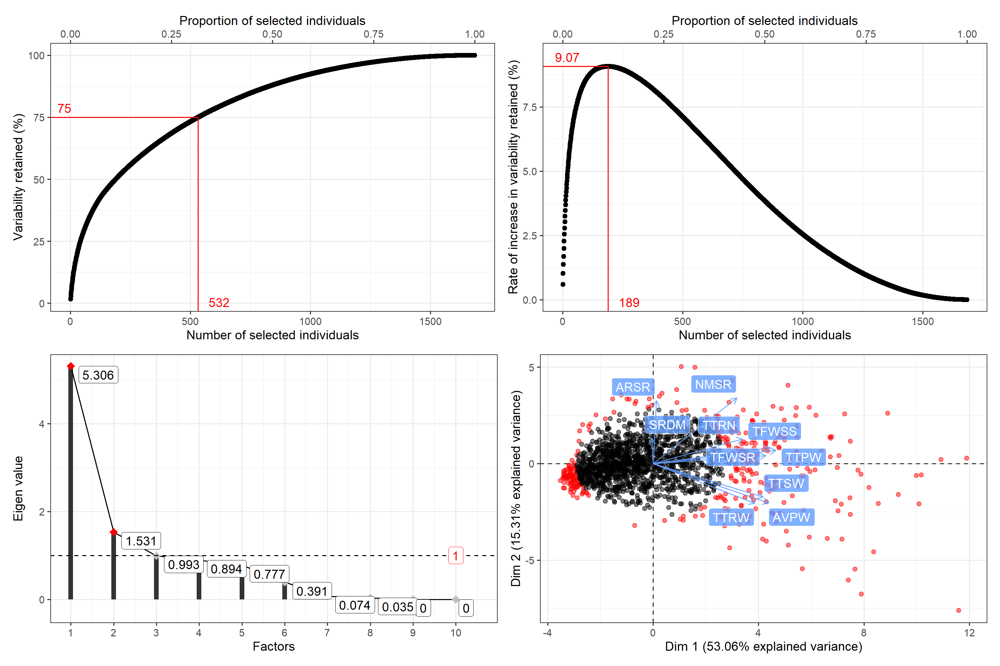

## `rpcss`: Constitution of Core Collections by Principal Component Scoring Strategy 

###### Version : [0.1.1.9000](https://aravind-j.github.io/rpcss/); Copyright (C) 2024-2026: [ICAR-NBPGR](https://nbpgr.org.in/); License: [GPL-2\|GPL-3](https://www.r-project.org/Licenses/)

##### *Aravind, J. and Singh, Anju M.*

Division of Germplasm Conservation, ICAR-National Bureau of Plant
Genetic Resources, New Delhi.

------------------------------------------------------------------------

[](https://cran.r-project.org/)
[](https://www.gnu.org/licenses/gpl-3.0)
[](https://cran.r-project.org/package=rpcss)
[](https://cran.r-project.org/package=rpcss)
[](https://CRAN.R-project.org/package=rpcss)
[](https://github.com/aravind-j/rpcss)
[](https://github.com/aravind-j/rpcss)
[](https://github.com/aravind-j/rpcss/actions)
[](https://www.repostatus.org/#wip)
[](https://lifecycle.r-lib.org/articles/stages.html#maturing)
[](https://github.com/aravind-j/rpcss/)
[](https://doi.org/10.5281/zenodo.14889174)
[](https://aravind-j.github.io/rpcss/)
[](https://rpcss-gh.goatcounter.com/)

------------------------------------------------------------------------

## Description

Generate a Core Collection with Principal Component Scoring Strategy
(PCSS) using qualitative and/or quantitative trait data according to
Hamon and Noirot (1990)
\<<https://www.documentation.ird.fr/hor/fdi:36506>\>, Noirot et
al. (1996) \<[doi:10.2307/2527837](https://doi.org/10.2307/2527837)\>
and Noirot et al. (2003)
\<<https://www.documentation.ird.fr/hor/fdi:010031886>\>.



## Installation

The package can be installed from CRAN as follows:

The development version can be installed from github as follows:

``` r

# Install development version from Github
devtools::install_github("aravind-j/rpcss")
```

## What’s new

To know whats new in this version type:

``` r

news(package='rpcss')
```

## Links

[CRAN page](https://cran.r-project.org/package=rpcss)

[Github page](https://github.com/aravind-j/rpcss)

[Documentation website](https://aravind-j.github.io/rpcss/)

[Zenodo DOI](https://doi.org/10.5281/zenodo.14889174)

## CRAN checks

[](https://cran.r-project.org/web/checks/check_results_rpcss.html)

| Flavour | CRAN check |
|----|----|
| r-devel-linux-x86_64-debian-clang | [](https://cran.r-project.org/web/checks/check_results_rpcss.html) |
| r-devel-linux-x86_64-debian-gcc | [](https://cran.r-project.org/web/checks/check_results_rpcss.html) |
| r-devel-linux-x86_64-fedora-clang | [](https://cran.r-project.org/web/checks/check_results_rpcss.html) |
| r-devel-linux-x86_64-fedora-gcc | [](https://cran.r-project.org/web/checks/check_results_rpcss.html) |
| r-patched-linux-x86_64 | [](https://cran.r-project.org/web/checks/check_results_rpcss.html) |
| r-release-linux-x86_64 | [](https://cran.r-project.org/web/checks/check_results_rpcss.html) |

[](https://cran.r-project.org/web/checks/check_results_rpcss.html)

| Flavour | CRAN check |
|----|----|
| r-devel-windows-x86_64 | [](https://cran.r-project.org/web/checks/check_results_rpcss.html) |
| r-release-windows-x86_64 | [](https://cran.r-project.org/web/checks/check_results_rpcss.html) |
| r-oldrel-windows-x86_64 | [](https://cran.r-project.org/web/checks/check_results_rpcss.html) |

[](https://cran.r-project.org/web/checks/check_results_rpcss.html)

| Flavour | CRAN check |
|----|----|
| r-release-macos-x86_64 | [](https://cran.r-project.org/web/checks/check_results_rpcss.html) |
| r-oldrel-macos-x86_64 | [](https://cran.r-project.org/web/checks/check_results_rpcss.html) |

## Citing `rpcss`

To cite the methods in the package use:

``` r

citation("rpcss")
```

``` R
To cite the R package 'rpcss' in publications use:

  Aravind, J. (2026).  rpcss: Constitution of Core Collections by Principal
  Component Scoring Strategy. R package version 0.1.1.9000,
  https://aravind-j.github.io/rpcss/https://cran.r-project.org/package=rpcsshttps://doi.org/10.5281/zenodo.14889174.

A BibTeX entry for LaTeX users is

  @Manual{,
    title = {rpcss: Constitution of Core Collections by Principal Component Scoring Strategy},
    author = {J. Aravind and Anju Mahendru Singh},
    note = {R package version 0.1.1.9000 https://aravind-j.github.io/rpcss/ https://cran.r-project.org/package=rpcss https://doi.org/10.5281/zenodo.14889174},
    year = {2026},
  }

This free and open-source software implements academic research by the authors and
co-workers. If you use it, please support the project by citing the package.
```
